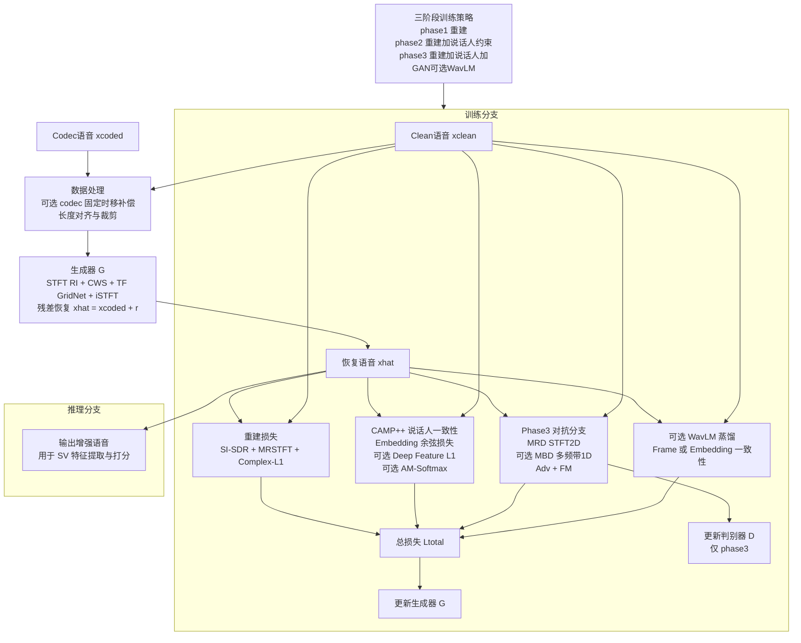

# SV-CodecRestoreGAN 方法说明（与当前实现一致）

本文档按当前代码与实验记录（A / B / B2）整理，避免旧版描述与实际实现不一致。

## 1. 目标与主线

- 任务：输入 16k coded 语音，输出 16k restored 语音。
- 训练主线：以重建损失为基础，在 phase2/phase3 按开关加入 speaker / GAN / WavLM 约束。
- 评测主线：以 SV 指标（EER/minDCF）验证 restored 是否优于 coded，同时监控重建指标。

## 2. 当前代码结构

- 训练入口：my_methods_GAN/scripts/train_sv_codec_restore_gan.py
- 训练引擎：my_methods_GAN/sv_codec_restore_gan/train/engine.py
- 生成器：my_methods_GAN/sv_codec_restore_gan/models/generator.py
- 判别器：my_methods_GAN/sv_codec_restore_gan/models/discriminators.py
- 重建损失：my_methods_GAN/sv_codec_restore_gan/models/losses.py
- CAMP++封装：my_methods_GAN/sv_codec_restore_gan/models/campplus_wrapper.py
- 评测入口：my_methods_GAN/scripts/eval_sv_codec_restore_gan.py

## 3. 训练阶段与损失（按当前实现）

### 3.1 三阶段定义

- Phase1：仅生成器 + 重建损失。
- Phase2：默认仍以重建为主，可选加入 CAMP++ embedding loss、CAMP++ deep feature loss、AM-Softmax 分类损失。
- Phase3：在 Phase2 基础上可选加入 GAN（MRD/MBD）与 WavLM distillation。

注意：GAN 与 WavLM 是否启用完全由开关决定，不是固定每个 phase 必开。

### 3.2 重建损失

`losses.py` 返回的重建总项为：

- rec_total = si_sdr_weight * si_sdr_term + mrstft_weight * mrstft_term + complex_weight * complex_term

其中日志中的 `si_sdr` 是损失形式（通常为 `-SI-SDR`），出现负值是正常现象。

### 3.3 Speaker 相关损失

- CAMP++ embedding loss（`use_campplus_train_loss`）：
  - spk_raw = 1 - cos(emb_rest, emb_clean)
  - spk_weighted = spk_loss_weight * spk_raw

- CAMP++ deep feature loss（`use_campplus_feat_loss`）：
  - 对 `campplus_feat_layers` 指定层做 L1，层间取平均
  - spk_feat_weighted = campplus_feat_loss_weight * spk_feat_raw

- AM-Softmax（`use_spk_amsoftmax`）：
  - spk_cls_weighted = spk_cls_loss_weight * spk_cls_raw

### 3.4 GAN 与 WavLM（仅在 phase3 且开关开启时）

- GAN 项：`adv_loss_weight * adv_g + fm_loss_weight * feat_g`
- WavLM 项：`wavlm_loss_weight * wavlm_term`

### 3.5 生成器总损失

- 基础：g_loss = rec_total
- 然后按条件叠加：
  - + spk_weighted
  - + spk_feat_weighted
  - + spk_cls_weighted
  - + GAN 项（phase3 + 开启）
  - + WavLM 项（phase3 + 开启）

## 4. A / B / B2 实验定位

### 4.1 Experiment A（Rec-only baseline）

- 核心思想：先学稳定重建。
- 常见配置：phase1>0，phase2=0，phase3=0。
- 用途：作为后续 B/B2 的 warm-start 来源。

### 4.2 Experiment B（CAMP++ teacher 微调）

- 核心思想：在 A 的基础上引入 speaker 约束提升 SV 保真。
- 常见配置：phase1=0, phase2>0, phase3=0，启用 `use_campplus_train_loss`。
- 可选：AM-Softmax 作为额外分类监督。

### 4.3 Experiment B2（当前主推版本）

- 核心思想：B 的稳态化版本，强调可微前端与 feature-level teacher 监督。
- 常见配置：
  - `campplus_frontend=diff_mel`
  - `use_campplus_train_loss`
  - `use_campplus_feat_loss`
  - `no_use_spk_amsoftmax`（先减少目标冲突）
  - `phase3_no_gan` + `phase3_no_wavlm`（先稳定 phase2 效果）
- 当前日志经验：`spk_raw` 与 `spk_feat_raw` step 级波动正常，应看 epoch 均值趋势。

## 5. 模型保存与“best”定义

训练中每个 epoch 都会保存 `checkpoints/epoch_xxx.pt`，并额外维护两个 best：

- `best_generator.pt`：按 `valid_rec` 最小保存（重建最优）。
- `best_generator_sv.pt`：按 `valid_sv_cos` 最大保存（SV 一致性最优）。

因此，若目标是后续 SV 评测，通常需要同时比较这两个 best 的评测结果。

## 6. 评测实现与加速

`eval_sv_codec_restore_gan.py` 当前支持：

- 条件拆分评测：`--conditions clean,coded,restored`
- restored 分块推理：`restore_chunk_seconds / overlap_seconds / chunk_batch_size`
- embedding 缓存与增量续跑：`use_cache + cache_incremental`
- trial 分层抽样（按正负样本对）：
  - `trial_sample_fraction`
  - `trial_sample_total`
  - `trial_sample_pos_count / trial_sample_neg_count`

注意：trial 抽样是“按 pair 抽样”，不等价于“按 utt 抽样”，高比例时 utt 覆盖仍可能接近全量。

## 7. 数据与采样约定

- 训练数据应保持 clean/coded 成对同源。
- 已支持 multi-codec manifest（同一 clean 对应多个 codec 路径，训练时随机采样）。
- 已实现 clean/coded 对齐裁剪（同起点截取），避免 pair 错位。
- 在线抽样支持 speaker 分层：`train_sample_fraction / valid_sample_fraction` + `*_stratified_sample`。

## 8. 当前实践建议

- 先用 A 获得稳定重建初始化，再做 B/B2 微调。
- B2 中先关闭 AM-Softmax，待重建与 SV 指标稳定后再做增量 ablation。
- 关注 epoch 级趋势而非 step 级抖动；必要时用 `plot_epoch_spk_trend.py` 观察 `spk_raw/spk_feat_raw` 的均值与方差。

## 9. SC-GridRestore 整体框图与方法说明

本节给出 SC-GridRestore 的整体框图、基本原理和执行过程，可直接用于实验报告或论文方法章节。

### 9.1 整体框图（训练 + 推理）

### 9.2 基本原理

SC-GridRestore 的目标是同时满足两类约束：

- 声学恢复：让恢复语音尽可能接近 clean 语音（失真小、频谱细节好）。
- 说话人保持：让恢复后说话人表征与 clean 保持一致（SV 友好）。

可写为一个加权多目标优化：

$$
\hat{x}=G(x_{\text{coded}}),\quad
\mathcal{L}_{\text{total}}=\mathcal{L}_{\text{rec}}+\lambda_{\text{spk}}\mathcal{L}_{\text{spk}}+\lambda_{\text{gan}}\mathcal{L}_{\text{adv}}+\lambda_{\text{fm}}\mathcal{L}_{\text{fm}}+\lambda_{\text{wavlm}}\mathcal{L}_{\text{wavlm}},\quad
\min_G\,\mathcal{L}_{\text{total}}.
$$

其中：

- $\mathcal{L}_{rec}$：重建损失（SI-SDR + MRSTFT + Complex-L1）。
- $\mathcal{L}_{spk}$：说话人一致性损失（CAMP++ embedding/feature，及可选 AM-Softmax）。
- $\mathcal{L}_{adv}, \mathcal{L}_{fm}$：对抗学习与特征匹配（phase3 启用）。
- $\mathcal{L}_{wavlm}$：可选 WavLM 蒸馏项（phase3 可选）。

### 9.3 执行过程（按训练/推理时序）

1. 数据配对与预处理

- 输入成对样本 $(x_{clean}, x_{coded})$。
- 可选按 codec 类型施加固定时移补偿（如 AMR-WB）。
- 做长度对齐后进行裁剪/补零，得到统一长度片段。

2. 生成器前向恢复

- 对 $x_{coded}$ 做 STFT，使用实部/虚部联合建模。
- 通过 CWS 与 TF-GridNet block 在时频域提取上下文。
- 经 iSTFT 回到波形，输出残差恢复结果：

$$
\hat{x} = x_{coded} + r
$$

3. 多损失联合优化（按 phase 开关）

- phase1：仅重建损失，先学稳定去失真能力。
- phase2：在重建基础上加入 speaker 一致性约束，提高身份保真。
- phase3：在 phase2 基础上加入 GAN（和可选 WavLM），提升感知细节与自然度。

4. 反向传播与参数更新

- 每 step 更新生成器；phase3 中按配置更新判别器。
- 记录 train/valid 的重建与 SV 指标，保存 best checkpoint。

5. 推理执行

- 推理时仅保留生成器 $G$。
- 输入 coded 语音后输出 restored 语音，再进入 SV 嵌入提取与打分。

### 9.4 方法要点总结

- 结构层面：时频建模（GridNet）适合 codec 伪影恢复。
- 目标层面：重建约束 + 身份约束共同优化，避免“听感变好但身份漂移”。
- 训练层面：三阶段递进提高稳定性，降低直接对抗训练的不确定性。
- 部署层面：推理仅需生成器，工程开销可控。
